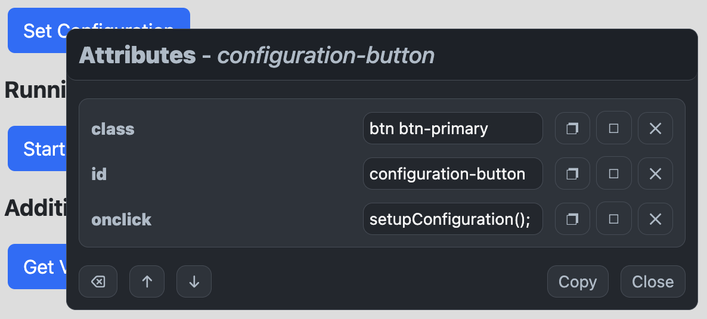
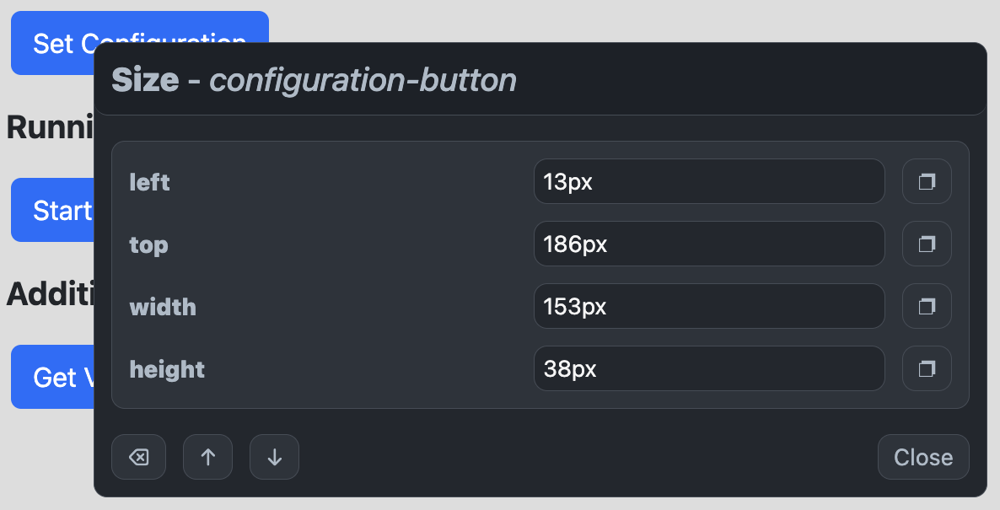

<h1 align="center">
Peek.js

[](https://twitter.com/intent/tweet?text=Peek.js%2C%20a%20free%20JavaScript%json%20converter&url=https://github.com/williamtroup/Peek.js&hashtags=javascript,element,property,viewer)
[](https://www.npmjs.com/package/jpeek.js)
[](https://www.nuget.org/packages/Peek.js/)
[](https://github.com/williamtroup/Peek.js/blob/main/LICENSE.txt)
[](https://github.com/williamtroup/Peek.js/discussions)
[](https://william-troup.com/)
</h1>

> <p align="center">🐛 A lightweight JavaScript library that attaches a viewer to a specific node type, allowing you to view the CSS properties, attributes, and size/position.</p>
> <p align="center">v1.3.0</p>
<br />




<br>
<br>


<h1>What features does Peek.js have?</h1>

- Zero-dependencies and extremely lightweight!
- Written in TypeScript, allowing greater support for React, Angular, and other libraries!
- Full API available via public functions.
- 4 modes supported:  CSS, Attributes, Size/Position, and Classes.
- Fully configurable.
- Edit CSS, Attribute, and Class values on the fly!
- Exclude specific DOM elements by using the ignore attribute!
- Show only the data your interested in!
- Copy, Paste, and Remove CSS, Attributes, and Classes!
- Move the dialog away from the element to lock it!
<br />
<br />


<h1>What browsers are supported?</h1>

All modern browsers (such as Google Chrome, FireFox, and Opera) are fully supported.
<br>
<br>


<h1>What are the most recent changes?</h1>

To see a list of all the most recent changes, click [here](docs/CHANGE_LOG.md).
<br>
<br>


<h1>How do I install Peek.js?</h1>

You can install the library with npm into your local modules directory using the following command:

```markdown
npm install jpeek.js
```

You can also use the following CDN links:

```markdown
https://cdn.jsdelivr.net/gh/williamtroup/Peek.js@1.3.0/dist/peek.min.js
https://cdn.jsdelivr.net/gh/williamtroup/Peek.js@1.3.0/dist/peek.js.min.css
```
<br>
<br>


<h1>How do I get started?</h1>

To get started using Peek.js, do the following steps:
<br>
<br>

### 1. Prerequisites:

Make sure you include the "DOCTYPE html" tag at the top of your HTML, as follows:

```markdown
<!DOCTYPE html>
```
<br>


### 2. Include Files:

```markdown
<link rel="stylesheet" href="dist/peek.js.css">
<script src="dist/peek.js"></script>
```
<br>


### 3. Start Viewing:

```markdown
<script> 
  $peek.start( {
      nodeType: "button"
  } );
</script>
```

To see a list of all the available binding options you can use, click [here](docs/options/OPTIONS.md).

<br>


### 4. Finishing Up:

That's it! Nice and simple. Please refer to the code if you need more help (fully documented).
<br>
<br>

<h1>How do I go about customizing Peek.js?</h1>

To customize, and get more out of Peek.js, please read through the following documentation.
<br>
<br>


### 1. Public Functions:

To see a list of all the public functions available, click [here](docs/PUBLIC_FUNCTIONS.md).
<br>
<br>


### 2. Configuration:

Configuration options allow you to customize how Peek.js will function.  You can set them as follows:

```markdown
<script> 
  $peek.setConfiguration( {
      dialogDisplayDelay: 500
  } );
</script>
```

To see a list of all the available configuration options you can use, click [here](docs/configuration/OPTIONS.md).